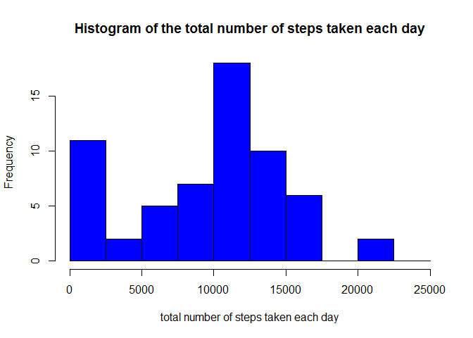
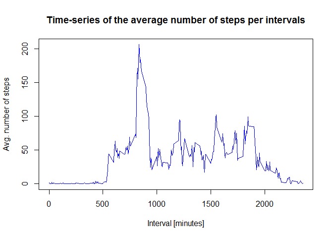
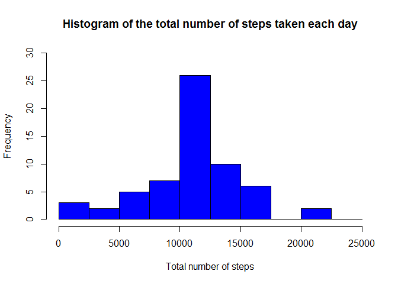
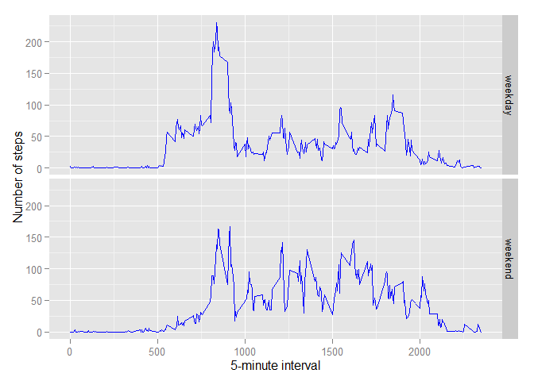

    # Clear the workspace
    rm(list=ls())

    #load library
    library(ggplot2)

Set working directory and load files

    path <- "C:/Coursera/ReproRes/"   
    setwd(path)
    unzip(zipfile="repdata-data-activity.zip")
    activityData <- read.csv("activity.csv")

Histogram of the total number of steps taken each day

    sumOfSteps <- tapply(activityData$steps, activityData$date, FUN=sum, na.rm=TRUE)
    hist(sumOfSteps, breaks=seq(from=0, to=25000, by=2500), xlab="total number of steps taken each day"
         ,col="blue"
         ,main="Histogram of the total number of steps taken each day")

<!-- -->

Mean and median number of steps taken each day

    mean_sumOfSteps <- mean(sumOfSteps, na.rm=TRUE)
    median_sumOfSteps <- median(sumOfSteps, na.rm=TRUE)
    paste(mean_sumOfSteps)

    ## [1] "9354.22950819672"

    paste(median_sumOfSteps)

    ## [1] "10395"

Time series plot of the average number of steps taken

    average <- aggregate(x=list(steps=activityData$steps), by=list(interval=activityData$interval),
                          FUN=mean, na.rm=TRUE)
    plot(average$interval, 
         average$steps, 
         type="l", 
         col="blue", 
         xlab="Interval [minutes]", 
         ylab="Avg. number of steps", 
         main="Time-series of the average number of steps per intervals")

<!-- -->
The maximum number of steps On average across all the days for the
5-minute interval

    average[which.max(average$steps),]

    ##     interval    steps
    ## 104      835 206.1698

Imputing Missing Variable

    missing <- is.na(activityData$steps)
    table(missing)

    ## missing
    ## FALSE  TRUE 
    ## 15264  2304

All of the missing values are filled in with mean value

    fill_val <- function(steps, interval) {
      filled <- NA
      if (!is.na(steps))
        filled <- c(steps)
      else
        filled <- (average[average$interval==interval, "steps"])
      return(filled)
    }

    activityData$steps <- mapply(fill_val, activityData$steps, activityData$interval)

Histogram of the total number of steps taken each day after missing
values are imputed

    sumOfSteps_imputed <- tapply(activityData$steps, activityData$date, FUN=sum)
    hist(sumOfSteps_imputed , 
         breaks=seq(from=0, to=25000, by=2500),
         col="blue", 
         xlab="Total number of steps", 
         ylim=c(0, 30), 
         main="Histogram of the total number of steps taken each day")

<!-- -->

    sumOfSteps_imputed_mean <- mean(sumOfSteps_imputed)
    sumOfSteps_imputed_median <- median(sumOfSteps_imputed)

    paste(sumOfSteps_imputed_mean)

    ## [1] "10766.1886792453"

    paste(sumOfSteps_imputed_median)

    ## [1] "10766.1886792453"

Finding differences in activity patterns between weekdays and weekends

    weekday_weekend <- function(date) {
      day <- weekdays(date)
      if (day %in% c("Monday", "Tuesday", "Wednesday", "Thursday", "Friday"))
        return("weekday")
      else if (day %in% c("Saturday", "Sunday"))
        return("weekend")
      else
        stop("invalid date")
    }

    activityData$date <- as.Date(activityData$date)
    activityData$day <- sapply(activityData$date, FUN=weekday_weekend)
    aveg2 <- aggregate(steps ~ interval + day, data=activityData, mean)

    ggplot(aveg2, aes(interval, steps)) + geom_line(colour = "blue") + facet_grid(day ~ .) +
      xlab("5-minute interval") + ylab("Number of steps")

<!-- -->
